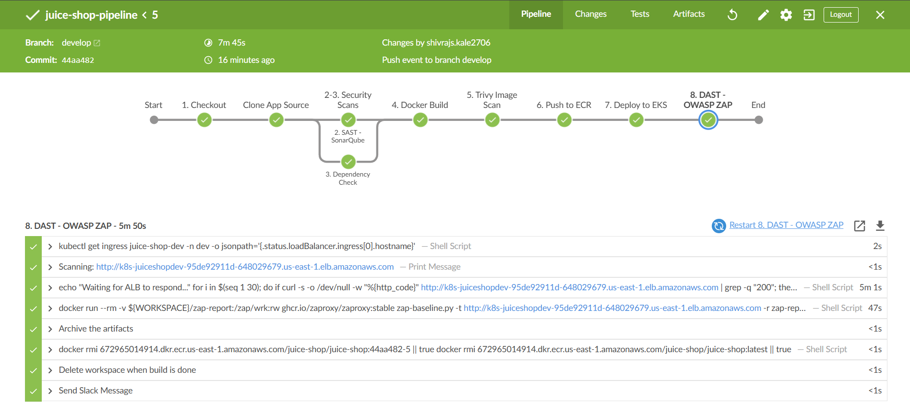
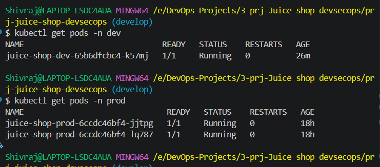
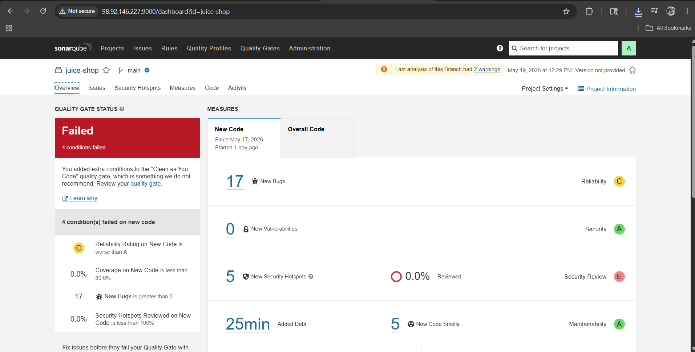
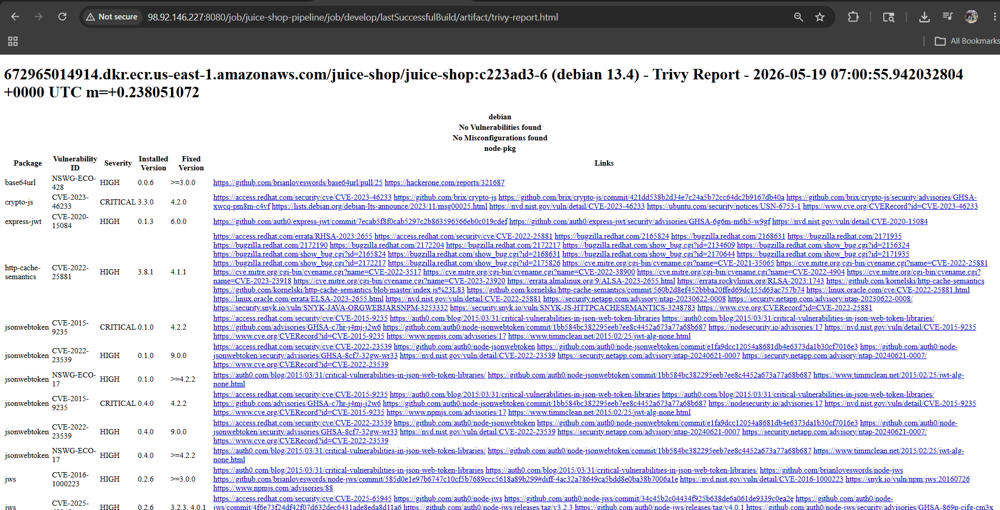
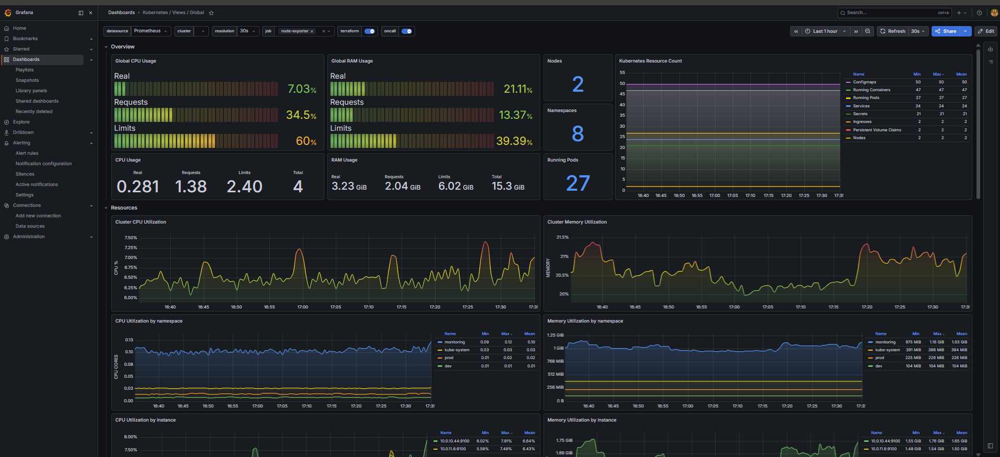
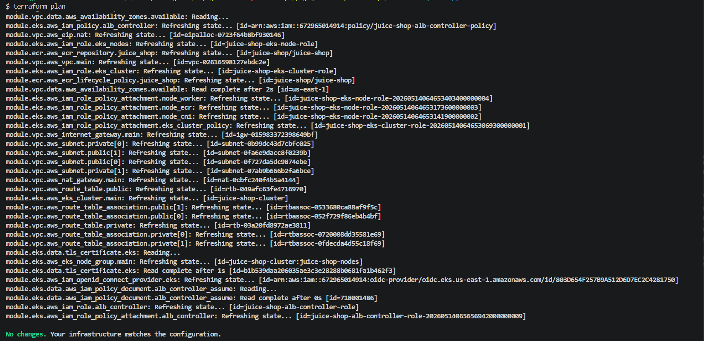
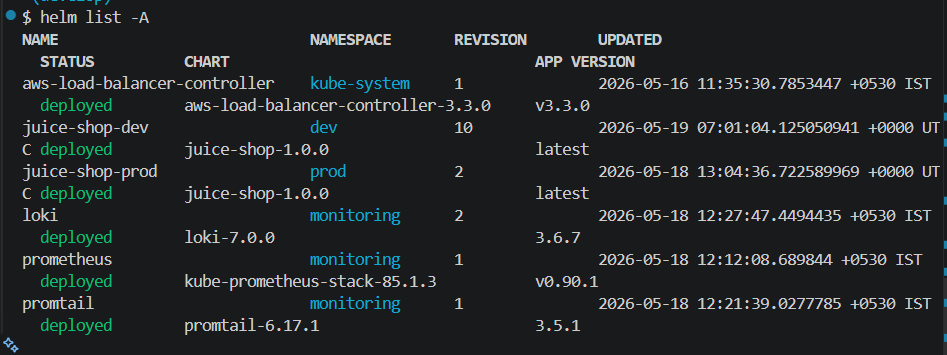
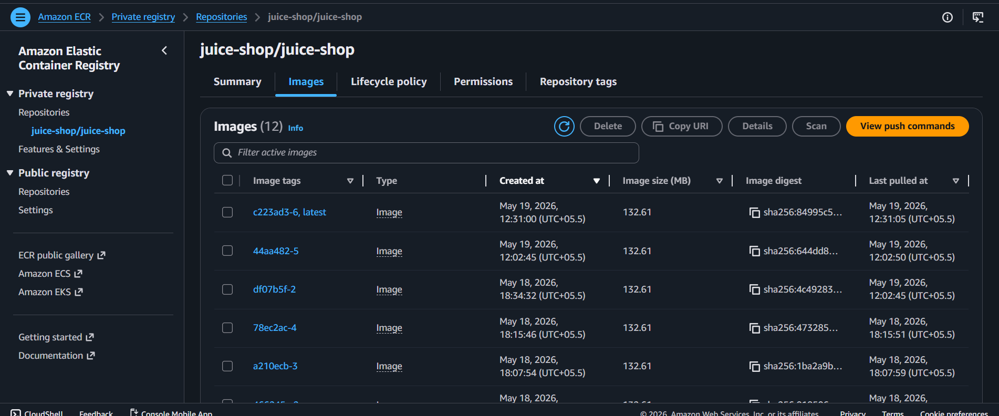
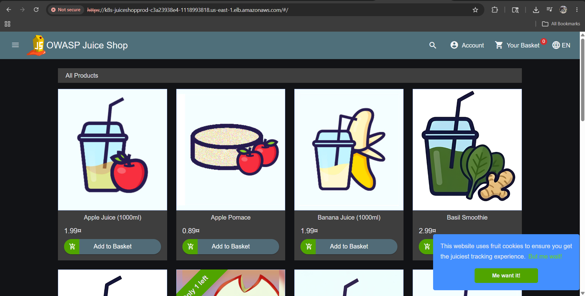

# OWASP Juice Shop — Production-Grade DevSecOps Pipeline

An end-to-end DevSecOps pipeline deploying [OWASP Juice Shop](https://owasp.org/www-project-juice-shop/) on AWS EKS with Jenkins CI/CD, four security scanning tools, multi-environment promotion, full observability, and SSL/TLS — built entirely from scratch using Infrastructure as Code.



---

## What this project does

This project takes a deliberately vulnerable web application (OWASP Juice Shop) and wraps it in a production-grade DevSecOps pipeline. Every push to `develop` triggers an 8-stage Jenkins pipeline that runs static analysis, dependency scanning, container scanning, builds and pushes a Docker image to ECR, deploys to an EKS dev namespace via Helm, and runs dynamic application security testing. Merging to `main` promotes the same image to the production namespace. Prometheus, Grafana, and Loki provide full-stack observability.

---

## Tech stack

| Category | Tool | Purpose |
|----------|------|---------|
| Cloud | AWS (EKS, ECR, ALB, ACM, IAM) | Hosting, container registry, load balancing |
| IaC | Terraform | VPC, EKS cluster, ECR repo, IAM roles (modular) |
| Container orchestration | Kubernetes (EKS v1.30) | Workload scheduling, namespace isolation |
| CI/CD | Jenkins (Declarative Pipeline) | 8-stage pipeline with parallel security scans |
| Package management | Helm | Templated K8s manifests with per-environment values |
| SAST | SonarQube | Static code analysis (bugs, code smells) |
| SCA | OWASP Dependency-Check | Known CVEs in third-party libraries |
| Container scanning | Trivy | HIGH/CRITICAL vulnerabilities in Docker images |
| DAST | OWASP ZAP | Runtime security testing against live application |
| Monitoring | Prometheus + Grafana | Metrics collection, dashboards, alerting |
| Logging | Loki + Promtail | Centralized log aggregation |
| TLS | AWS ACM (self-signed cert) | HTTPS on ALB ingress |
| Notifications | Slack | Build success/failure alerts |
| Version control | GitHub (GitFlow) | Branch-based promotion (develop → dev, main → prod) |

---

## Pipeline stages

The Jenkins pipeline runs 8 stages on every push. Stages 2 and 3 execute in parallel to reduce build time.

```
1. Checkout           → Clone repo, set image tag from git commit + build number
2. SAST (SonarQube)   → Static analysis on application source code        ┐ parallel
3. Dependency Check   → Scan dependencies for known CVEs                  ┘
4. Docker Build       → Build image from Juice Shop source
5. Trivy Image Scan   → Scan built image for HIGH/CRITICAL vulnerabilities
6. Push to ECR        → Push tagged image to AWS ECR
7. Deploy to EKS      → Helm upgrade to dev or prod namespace
8. DAST (OWASP ZAP)   → Baseline security scan against live application
```



---

## Multi-environment setup

The pipeline uses branch-aware logic to deploy to different environments:

| Branch | Namespace | Replicas | Autoscaling | ALB Group |
|--------|-----------|----------|-------------|-----------|
| `develop` | dev | 1 | Disabled | juice-shop-dev |
| `main` | prod | 2 | HPA (2-5 pods, 70% CPU) | juice-shop-prod |

The promotion flow: push to `develop` → pipeline deploys to dev → create PR → merge to `main` → pipeline deploys to prod. Both environments use the same Helm chart with different values files (`values-dev.yaml`, `values-prod.yaml`).



---

## Security scanning

**SonarQube (SAST)** scans the Juice Shop application source code for bugs, code smells, and security vulnerabilities. Since Juice Shop is intentionally vulnerable, SonarQube correctly identifies issues — this validates the scanner is working, not a problem to fix.



**Trivy** scans the built Docker image for HIGH and CRITICAL CVEs before it reaches ECR. Reports are archived as Jenkins artifacts.



**OWASP ZAP** runs a baseline scan against the live application after deployment. Findings are expected — Juice Shop is designed to be exploitable. The ZAP report documents the attack surface.

**OWASP Dependency-Check** scans third-party libraries for known vulnerabilities (CVEs). Configured to fail the build only on CVSS score ≥ 9.

---

## Monitoring and alerting

The observability stack runs in the `monitoring` namespace:

- **Prometheus** collects metrics from all namespaces with 7-day retention on persistent storage (EBS)
- **Grafana** provides dashboards for cluster health, node metrics, pod performance, and application-specific panels
- **Loki + Promtail** aggregates container logs from every node via DaemonSet
- **Alertmanager** routes alerts to Slack with rules for pod crash loops, high CPU, and replica mismatches

### Custom Juice Shop dashboard

Built a dedicated dashboard with four panels: pod CPU usage, pod memory, restart count, and application logs from Loki — filtered to dev and prod namespaces.


### Cluster overview



### Additional dashboards

| Dashboard | Screenshot |
|-----------|------------|
| Node Exporter Full | [View](docs/screenshots/10-Grafana-Node%20Exporter%20Full.png) |
| Kubernetes Pods | [View](docs/screenshots/09-Grafana-Kubernetes-Views-Pods.png) |
| Prometheus Overview | [View](docs/screenshots/11-Grafana-Prometheus%20Overview.png) |

### Alert rules

Three PrometheusRule alerts are configured:

- **PodCrashLooping** — fires when any pod in dev/prod restarts repeatedly (severity: critical)
- **HighCPUUsage** — fires when pod CPU exceeds 80% for 5 minutes (severity: warning)
- **ReplicasMismatch** — fires when desired replicas ≠ ready replicas for 5 minutes (severity: critical)

---

## Infrastructure

All infrastructure is managed by Terraform with a modular structure:

```
terraform/
├── main.tf                 # VPC, EKS, ECR module calls
├── variables.tf            # Input variable definitions
├── terraform.tfvars        # Actual values (gitignored)
├── terraform.tfvars.example # Template for others to use
├── outputs.tf              # Cluster endpoint, ECR URL
├── backend.tf              # S3 remote state + DynamoDB locking
├── providers.tf            # AWS provider config
└── modules/
    ├── vpc/                # VPC, subnets (2 public + 2 private), NAT, IGW
    ├── eks/                # EKS cluster, managed node group, OIDC, ALB controller IAM
    └── ecr/                # ECR repository + lifecycle policy
```

**Key specs:**
- Region: us-east-1
- EKS: v1.30, 2x t3.large nodes (managed node group)
- Networking: custom VPC (10.0.0.0/16), private subnets for nodes, public subnets for ALB
- Storage: EBS CSI driver addon with IRSA for persistent volumes
- State: S3 backend with DynamoDB state locking



---

## Kubernetes hardening

- **RBAC**: Role-based access control for namespace isolation
- **NetworkPolicies**: Restrict inter-namespace traffic
- **ResourceQuotas**: CPU and memory limits per namespace to prevent noisy neighbors
- **Namespace isolation**: dev and prod workloads run in separate namespaces with independent ALB target groups

---

## How to deploy

### Prerequisites

- AWS account with IAM user (programmatic access)
- AWS CLI configured (`aws configure`)
- `kubectl`, `helm`, `terraform`, `docker` installed locally
- GitHub repository with webhook to Jenkins

### Steps

1. **Provision infrastructure**
   ```bash
   cd terraform
   cp terraform.tfvars.example terraform.tfvars  # fill in your values
   terraform init
   terraform plan
   terraform apply
   ```

2. **Configure kubectl**
   ```bash
   aws eks update-kubeconfig --region us-east-1 --name juice-shop-cluster
   ```

3. **Install EBS CSI driver**
   ```bash
   aws eks create-addon --cluster-name juice-shop-cluster \
     --addon-name aws-ebs-csi-driver \
     --service-account-role-arn <your-ebs-csi-role-arn>
   ```

4. **Install monitoring stack**
   ```bash
   helm install prometheus prometheus-community/kube-prometheus-stack \
     -n monitoring -f helm/observability/prometheus-values.yaml
   helm install loki grafana/loki \
     -n monitoring -f helm/observability/loki-values.yaml
   helm install promtail grafana/promtail -n monitoring \
     --set "config.clients[0].url=http://loki-gateway.monitoring.svc.cluster.local/loki/api/v1/push"
   ```

5. **Set up Jenkins** — Configure a Multibranch Pipeline pointing to this repo. Jenkins will auto-discover `develop` and `main` branches.

6. **Push to develop** — triggers the full pipeline and deploys to the dev namespace.

7. **Merge to main** — promotes to the prod namespace.

---

## Helm releases



---

## ECR images



---

## Application



---

## Repository structure

```
.
├── Jenkinsfile                        # 8-stage declarative pipeline
├── sonar-project.properties           # SonarQube scanner config
├── helm/
│   ├── prj-juice-shop/                # Application Helm chart
│   │   ├── Chart.yaml
│   │   ├── values.yaml                # Base values (shared config)
│   │   ├── values-dev.yaml            # Dev overrides (1 replica, no HPA)
│   │   ├── values-prod.yaml           # Prod overrides (2 replicas, HPA enabled)
│   │   └── templates/
│   │       ├── deployment.yaml
│   │       ├── service.yaml
│   │       ├── ingress.yaml
│   │       ├── hpa.yaml
│   │       └── ...
│   └── observability/
│       ├── prometheus-values.yaml     # kube-prometheus-stack overrides
│       └── loki-values.yaml           # Loki single-binary config
├── terraform/
│   ├── main.tf
│   ├── variables.tf
│   ├── outputs.tf
│   ├── backend.tf
│   └── modules/
│       ├── vpc/
│       ├── eks/
│       └── ecr/
├── k8s/
│   ├── namespaces.yaml
│   └── ...
├── scripts/
│   └── jenkins-bootstrap.sh
└── docs/
    ├── architecture/
    ├── grafana-dashboards/            # Exported dashboard JSON
    └── screenshots/
```

